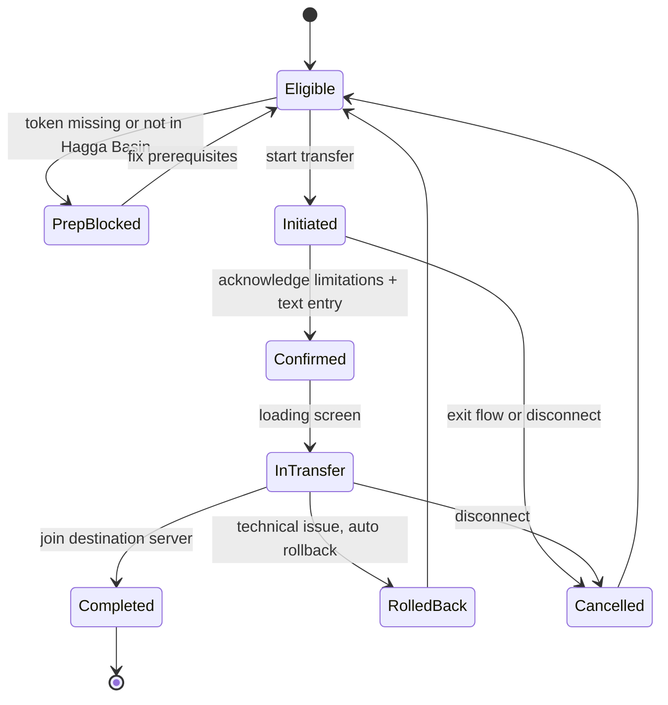
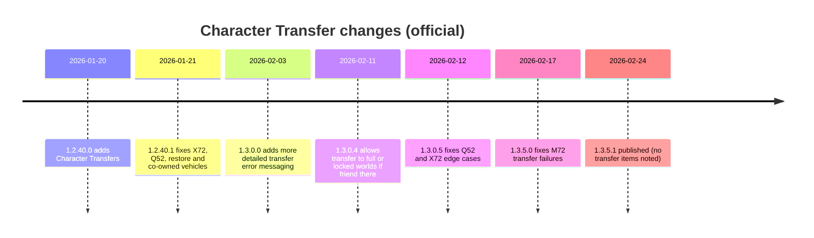

# Dune: Awakening Character Transfer Prep Guide

Last verified: 2026-02-26 (America/Los_Angeles)

This is a single-page, source-linked guide focused on safe, low-surprise Character Transfers.
Primary sources are Funcom Help Center and official duneawakening.com patch notes.
Anything not explicitly stated in those sources is marked as **Unspecified**.

## Executive summary

Character Transfers let you move your character plus a limited set of items to another server. Transfers can take a couple minutes and may temporarily block character access during the process.

Most irreversible losses happen because:
- A base or vehicle was not backed up into the correct tool before initiating transfer
- The base backup failed due to Base Reconstruction Tool restrictions
- The destination server was unavailable (maintenance, weekly active player limit, offline)
- The transfer flow was cancelled by disconnecting or exiting mid-flow

## TL;DR checklist (do this in order)

- [ ] Confirm transfer direction is allowed (especially Private → Official is not supported)
- [ ] Confirm destination server accepts transfers (private server setting may block) (**Unspecified** how this is surfaced in UI)
- [ ] Confirm you have 1 Transfer Token available (max hold is 1, replenishes 7 days after use)
- [ ] Travel to Hagga Basin (transfer can only start from Hagga Basin)
- [ ] Back up base(s) using Base Reconstruction Tool (BRT)
  - [ ] Ensure the backup succeeds (no BRT errors)
  - [ ] Ensure sub-fief console is on a foundation and all buildables are inside sub-fief bounds
  - [ ] Remember BRT stores up to 3 bases
- [ ] Back up vehicles using Vehicle Backup Tool (VBT)
  - [ ] If a vehicle cannot be stored normally, remove its inventory or relocate it, or disassemble with Welding Torch and store parts
  - [ ] If vehicle is too large to fit, disassemble with Welding Torch and store parts
- [ ] Put valuables into inventory or bank (both transfer)
- [ ] Start transfer from Server Browser or System Menu while in Hagga Basin
- [ ] Read the final confirmation screen, acknowledge limitations, do the manual text entry
- [ ] Do not disconnect or close the game until the loading screen finishes
- [ ] After transfer, validate at Griffin’s Reach:
  - [ ] Inventory, equipment, bank, Solari
  - [ ] BRT backups present
  - [ ] VBT backups present
  - [ ] Re-equip abilities if needed (Chapter 3 backend change note)

## Eligibility matrix

Legend:
- ✅ Supported (per official docs)
- ❌ Not supported (per official docs)
- ⚠️ Conditional (depends on private server settings or other gating)

| From \ To | Official server | Private server (accepts transfers) | Private server (blocks transfers) |
|---|---:|---:|---:|
| Official server | ✅ | ⚠️ | ❌ |
| Private server | ❌ | ✅ | ❌ |

Notes:
- Private server owners may restrict transfers in or out. Effects on “Official → Private” are explicitly conditional.
- Transfer cannot start if destination is unavailable: offline, maintenance, reached weekly active player limit, or otherwise unavailable.
- Patch note: transfer to full or locked worlds is allowed if the player has a friend there. **Unspecified** what “friend there” means.

## What transfers vs what does not

### Transfers (explicitly stated)

| Category | Transfers? | Notes |
|---|---:|---|
| Inventory contents (backpack + equipped) | ✅ | |
| Bank contents | ✅ | |
| Solari balance | ✅ | |
| Saved bases in Base Reconstruction Tool | ✅ | Only bases actually stored in BRT |
| Saved vehicles in Vehicle Backup Tool | ✅ | Only vehicles actually stored in VBT |

### Does not transfer (explicitly stated or implied by omission)

| Category | Transfers? | Notes |
|---|---:|---|
| Unbacked bases | ❌ | Left behind on origin server |
| Unbacked vehicles | ❌ | Left behind unless disassembled and parts stored in bank/inventory |
| Assembled vehicles inside a base backup | ❌ | BRT does not store assembled vehicles |
| Additional base permissions | ❌ | BRT does not store “additional permissions” |
| Vehicle module inventories | ❌ | VBT recovery/relocation notes indicate inventory modules are not recovered; transfer-specific behavior is **Unspecified** |

### Exchange / marketplace listings

**Unspecified in primary sources** whether listings carry across worlds during Character Transfer.
Safe practice:
- Cancel listings
- Claim completed orders
- Ensure valuables are in inventory or bank

## Hard prep steps

### Transfer Token discipline

- You start with 1 Transfer Token.
- You can hold a maximum of 1 token.
- After you use it, it replenishes automatically after 7 days.
- Transfers are final. Transferring again, including moving back, costs another token.

### Base Reconstruction Tool (BRT) prep

Before transfer:
- Back up the base while you are the owner of the base.
- Ensure sub-fief console is not on bare terrain. Place a foundation beneath it.
- Ensure everything attached is inside the sub-fief console limits.
- Confirm you are under the 3-base cap.
- Remember BRT is Hagga Basin only for both backup and restore.
- Remember per-base cooldown: after storing and placing a base once, you must wait 7 days before using the same base again.

Restore constraints that can cause post-transfer failures:
- Cannot overlap another landclaim
- Cannot overlap a no-building zone
- Cannot overlap a vehicle
- Placement can fail if another player stands in the destined landclaim
- Bases with Advanced Subfief Consoles cannot be placed in Hagga Basin South

### Vehicle Backup Tool (VBT) prep

Before transfer:
- Back up vehicles into VBT.
- If a vehicle cannot be stored normally, remove its inventory or use relocation, or disassemble with a welding torch to salvage parts.
- If a vehicle is too large to fit in the tool, disassemble it and store parts in bank or base storage.

Co-ownership note (patch behavior):
- If a co-owned vehicle is backed up and transferred, the transferring character becomes sole owner.
- Former co-owner may still have the vehicle counted against their limit until next server restart.

### Inventory and bank prep

- Inventory and bank transfer. Put anything you cannot replace quickly into bank or inventory.
- Take screenshots or write down:
  - Solari balance
  - High-value inventory items
  - Bank contents summary
  - BRT list of saved bases (names and counts)
  - VBT list of saved vehicles (names and counts)

## UX flow and transfer states

Start conditions:
- Must be in Hagga Basin
- Must have a Transfer Token
- Destination must be available and accept the transfer

Flow steps:
1. Start transfer from Server Browser or System Menu.
2. System shows a final confirmation screen with key limitations and items that may be lost.
3. You must acknowledge limitations and do manual text entry to proceed.
4. A loading screen displays while transfer completes.
5. After completion, you can join the new server.

Cancellation and lockout:
- Exiting the flow or closing the session cancels the transfer.
- No other transfers can be initiated on the account while a character is marked “In Transfer”.
- If a technical issue occurs during transfer, the system attempts to complete or roll back.

## Spawn location

After a successful transfer, your character spawns at:
- Griffin’s Reach (Hagga Basin) on the destination server

## Failure modes and error codes

### Transfer cannot start (preflight failure)

Transfer cannot begin if the destination server:
- is offline or closed
- is in maintenance
- has reached its weekly active player limit
- is otherwise unavailable

### Name conflicts

If your character name is already taken on the destination server, you will be prompted to enter a new name before completing the transfer.

### Known error codes in patch notes

- X72: transfer attempt can fail (fixed and re-fixed in multiple hotfixes)
- Q52: travel to password-protected Hagga Basin / Sietch issues on private servers (fixed and re-fixed in multiple hotfixes)
- M72: transfer failure cases (fixed in later patch)

## Post-transfer validation

Immediately after spawning at Griffin’s Reach:
1. Confirm character is playable (no stuck “In Transfer” state in server browser)
2. Verify inventory and equipped items
3. Verify bank contents and Solari balance
4. Verify BRT contains the expected saved bases
5. Verify VBT contains the expected saved vehicles
6. Restore base conservatively (avoid landclaim and no-build overlaps)
7. Restore vehicles / reassemble from stored parts
8. If abilities appear missing:
   - Re-equip abilities (Chapter 3 note)
   - If skill trees appear reset, re-spec your character

## Troubleshooting playbook

### If you hit X72 during transfer
- Ensure client is updated and retry later.
- Avoid starting transfer during known instability windows (maintenance, global downtime).
- If persistent, open an in-game support ticket with: time, origin/destination, screenshots.

### If you hit Q52 traveling to Hagga Basin (often private server, password-protected)
- If you control the server: temporarily remove password and retry travel (community workaround).
- Retry after server restart.
- If blocked from reaching Hagga Basin, transfer cannot be initiated.

### If you hit M72 during transfer
- Fixed in a later patch. Ensure you are on a version that includes the fix and retry.

### If base backup fails in BRT
Common causes:
- Sub-fief console on terrain (needs a foundation)
- Buildables attached outside sub-fief bounds
- Not the base owner
- Not in Hagga Basin (BRT is Hagga-only for backup and restore)

### If base restore fails
Common causes:
- Overlaps another landclaim
- Overlaps a no-building zone
- Overlaps a vehicle
- Player standing in destined landclaim
- Advanced Subfief Console restriction for Hagga Basin South

### If skills or abilities appear broken after transfer
- Re-equip abilities (Chapter 3 note)
- Confirm whether skill trees were reset due to backend change
- If you have 0 skill points and cannot recover by respec, treat as a bug, collect evidence and open an in-game support ticket

## Transfer-related patch and hotfix changelog (official)

| Date | Version | Transfer-relevant change | Link |
|---|---|---|---|
| 2026-01-20 | 1.2.40.0 | Character Transfers added. Spawn at Griffin’s Reach. Confirmation screen plus manual text entry. “In Transfer” lockout. | https://duneawakening.com/news/dune-awakening-1-2-40-0-patch-notes/ |
| 2026-01-21 | 1.2.40.1 | Fixes: X72 failed transfer, Q52 passworded Hagga travel on private servers, base restore no-build edge case, co-owned vehicle issues after transfer. | https://duneawakening.com/news/dune-awakening-1-2-40-0-patch-notes/ |
| 2026-02-03 | 1.3.0.0 | Added more detailed error messaging for Character Transfer failures. | https://duneawakening.com/news/dune-awakening-chapter-3-patch-notes/ |
| 2026-02-11 | 1.3.0.4 | Transfer allowed to full or locked worlds if player has a friend there. (Definition Unspecified.) | https://duneawakening.com/news/dune-awakening-chapter-3-patch-notes/ |
| 2026-02-12 | 1.3.0.5 | Fixes: Q52 edge case, X72 edge cases. | https://duneawakening.com/news/dune-awakening-chapter-3-patch-notes/ |
| 2026-02-17 | 1.3.5.0 | Fixes: Character Transfers failing with M72. Also fixes password prompt flow to Hagga Basin. | https://duneawakening.com/news/dune-awakening-chapter-3-patch-notes/ |
| 2026-02-24 | 1.3.5.1 | No transfer-specific notes in this hotfix section. | https://duneawakening.com/news/dune-awakening-chapter-3-patch-notes/ |

## Sources

Primary:
- Funcom Help Center: Character Transfers
  https://funcom.helpshift.com/hc/en/4-dune-awakening/faq/74-character-transfers/
- Funcom Help Center: Base Reconstruction Tool Guide
  https://funcom.helpshift.com/hc/en/4-dune-awakening/faq/72-base-reconstruction-tool-guide/
- Funcom Help Center: Stuck and lost Vehicles (Vehicle Backup Tool notes)
  https://funcom.helpshift.com/hc/en/4-dune-awakening/faq/68-stuck-and-lost-vehicles/
- Official patch notes: 1.2.40.0 (includes 1.2.40.1 hotfix section)
  https://duneawakening.com/news/dune-awakening-1-2-40-0-patch-notes/
- Official patch notes: Chapter 3 patch notes (includes all 1.3.x hotfix sections)
  https://duneawakening.com/news/dune-awakening-chapter-3-patch-notes/

Community (non-authoritative):
- Q52 travel error thread
  https://www.reddit.com/r/duneawakening/comments/1qibta8/q52_travel_error_on_12400_trying_to_get_back_into/
- “character already exists” / X72 question
  https://www.reddit.com/r/duneawakening/comments/1qi98hj/character_transfer_only_between_servers_not/
- “Transfer ruined character” report
  https://www.reddit.com/r/duneawakening/comments/1r3rgwq/character_transfer_ruined_character_funcom/
